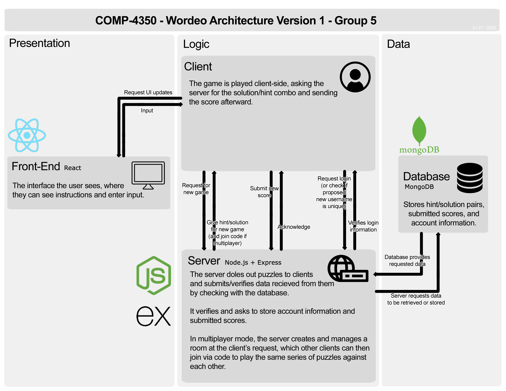
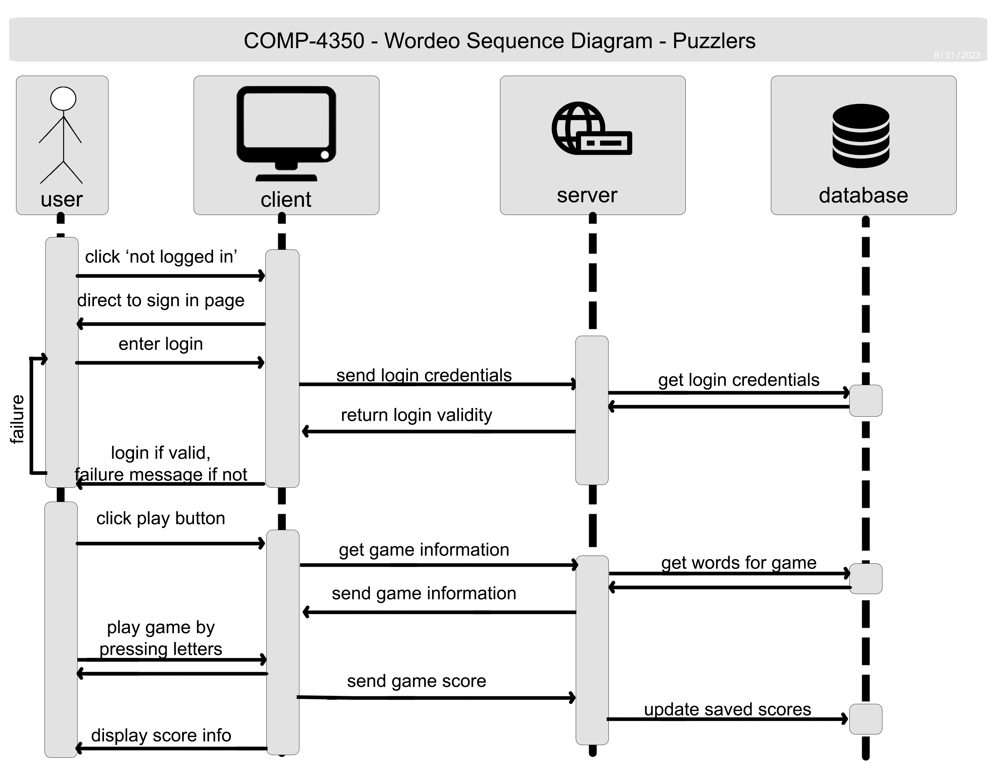

**Table of Contents**

1. [Puzzlers Team](#puzzlers-team)
2. [Project Proposal](#project-proposal)
3. [User Stories](#user-stories)
4. [Architecture](#architecture)
5. [Sequence](#sequence-diagram)
6. [Design](/images/design/DESIGN.md)
7. [Meetings](https://github.com/hamdielzard/Wordeo/wiki/Meetings)
8. [Wiki Homepage](https://github.com/hamdielzard/Wordeo/wiki)
9. [Test Plan](Wordeo%20Test%20Plan.pdf)

# Puzzlers Team
Dani Youn

Alyssa Gregorash

Souvik Ray

Hamdi Elzard

Benedict Agupitan

# Project Proposal
## Summary and Vision
Wordeo is a word guessing game similar to Wordle and Hangman.  In the base game, users try to spell a word with a given hint as quickly as possible within a given time limit.  Users can create an account to submit their scores, create rooms to play multiplayer, and earn in-game currency to purchase power-ups.

Wordeo is a game created for users who want to stimulate their brains while learning new words in a fun environment.  Wordeo challenges users to compete with each other on quick thinking.  Power-ups provide an additional strategy for users who want to top the leaderboards.

Wordeo is targeted at users on all levels.  As the user progresses through the words, the difficulty increases to continuously provide new challenges.  Speed is the key in Wordeo, as the points the user gains depend on how quickly they can guess.

Therefore, our stakeholders would be:
1. The Puzzlers Team
2. Our classmates in COMP 4350
3. Shayan Daneshvar (our TA in COMP 4350)
4. Shaowei Wang (our instructor in COMP 4350)

## Features
### Functional Features
1. Account Creation & Management
2. Leaderboard
3. Core game
    - Custom Game Settings
4. Multiplayer Rooms
    - Global/In-Game Chat
5. Currency System
    - Power-ups
    - In-game Store

### Non-Functional Features
1. Our system can respond to 100 users with 1000 requests per minute concurrently.

## Technologies
Wordeo will be built with the MERN stack, consisting of MongoDB, Express js, React js, and Node js.

The database will use MongoDB.
The backend server will use Node js with Express js.
The frontend client will use React js.

# User Stories
## Account Creation and Management
>As a website user
>
>I want to be able to create an account
>
>So that I can save a state of my game play

>As a logged in user
>
>I want to be able to update my nickname
>
>So that I can change it when I do not like my current nickname

>As a logged in user
>
>I want to be able to logout
>
>So that I can switch to another account

>As a logged in user
>
>I want to be able to see my personal best scores
>
>So that I can see where I stand compared to the board’s scores

>As a logged in user
>
>I want to see the currency I have and what powerups and cosmetics I bought with it
>
>So that I can verify I have bought something and that it is available for use

### *Scenario*
>User enters the website and creates a new account
>
>“Given that I am in a role of a website user
>
>When I click on the “sign-on” icon on the main screen
>
>Then the system shows a sign-on form with a username, nickname and password
>
>When I fill in all the text fields
>
>And I click on the “sign-on” button
>
>Then the system saves my username and password pair
>And the system takes me to the main screen with a logout button”

## Leaderboards
> As a logged in user
>
> I want to be able to see the game leaderboard
>
> So that I can check how good I am at the game in comparison to other users

>As a logged in user
>
>I want to submit my score after a game
>
>So that I can share my high score with other players

>As a logged in user
>
>I want to see high scores for different modes of the game, such as separate boards for solo play and multiplayer
>
>So that I can tell which score occurred under which set of rules

>As a logged in user
>
>I want my top leaderboard position highlighted
>
>So I can easily see what my top score is

>As a logged in user 
>
>I want to filter the list by username 
>
>So that I can look for my friends and rivals

### *Scenario*
>User checks the leaderboard after playing a few solo games
>
>“Given that I am in a role of a signed-in user
>
>When I click the leaderboard icon
>
>Then the system shows a list of users with their score and username ordered by the score
>
>And the system shows my highest score highlighted”

## Core Game
>As a user
>
>I want to be able to start a Wordeo game
>
>So that I can play a game of Wordeo alone to reach a new high score

> As a user
>
> I want to be able to adjust the game settings
>
> So that I can customize my game to my liking

> As a user
>
> I want to see a hint to help me guess the word
>
> So that I am not guessing letters blindly

>As a user
>
>I want to see which letters I have already guessed, and whether each one is correct
>
>So that I know how close I am to solving the puzzle

>As a user
>
>I want to see how much time is left to solve the puzzle
>
>So that I can strategize the best way to guess before time runs out

### *Scenario*
>User starts a single player game
>
>“Given that I am a user
>
>When I click the button ‘Singleplayer’ at the main screen
>
>Then the system starts a game of Wordle
>
>The system presents me with a hint, empty word boxes, and a timer
>
>When I click on a letter in my keyboard
>
>The system will reveal a letter of the word if it is correct
>
>The system will display the letter at the bottom of the screen if it is incorrect
>
>When I have guessed all the letters of the word
>
>The system will display a victory message and the game ends
>
>When I have run out of time
>
>The system will display a defeat message and the game ends
>
>When I click on the button 'Play again'
>
>Then the system starts a new game
>
>When I otherwise click on the button 'Leave game'
>
>The system displays the main screen"

## Multiplayer Rooms
>As a logged in user
>
>I want to be able to start a Wordeo game with other users
>
>So that I can play a game of Wordeo and compete with other users
>

>As a logged in user
>
>I want to be able to chat with other users in the multiplayer room
>
>So that I can talk about the game with other players
>

>As a logged in user
>
>I want to see what my score is, even if I lose the round
>
>So that I can see how close I was to the other players
>

>As a logged in user
>
>I want to play the same series of puzzles against others in real time
>
>So that we are all racing on the same set of words without risk of differing difficulty between players in the same game
>

>As a logged in user
>
>I want to join a multiplayer game via code the room’s creator has
>
>So that I can easily join my friends

### *Scenario*
>User starts a multiplayer game after logging in
>
>“Given that I am in a role of a signed-in user
>
>When I click the button “Multiplayer” at the main screen
>
>The system shows a screen

## Currency System
>As a logged in user 
>
>I would like to be able to earn in game currency
>
>So that I can buy in game items

>As a logged in user
>
>I want to be able to purchase in game items
>
>So that I can use the items to make the game easier

>As a logged in user
>
>I want to be able to use the powerups I have purchased
>
>So that I can shake up my playstyle by getting a boost

>As a logged in user
>
>I want to apply cosmetics I have bought
>
>So that my game has an exciting new look

>As a logged in user
>
>I want to read what an item does in the item store
>
>So that I can make informed purchases that best suit my playstyle

# Additional Features

## Custom Game Settings
>As a logged in user
>
>I want to be able to create a game with my own words
>
>So that I can adjust the difficulty of the game
>
>So that I can include words that do not exist already

>As a logged in user
>
>I want to be able to set custom game settings
>
>So that I can specify my own time limit and difficulty

>As a logged in user
>
>I want to be able to disallow powerups
>
>So that I can play multiplayer on a level playing field

### *Scenario*

>User creates a custom game with a list of word-definition pair
>
>"Given that I am in a role of a signed-in user
>
>When I click the button create custom game at the main screen
>
>The system shows a screen with an empty list and a button to add a new word
>
>When I click the button to add a new word
>
>Then the system shows two text fields where one is a word field and another is a definition field
>
>When I fill in both of the text fields
>
>And I click on the add button
>
>Then the system saves my new word
>
>And the system shows my new word on the list
>
>And the system shows "remove" and "edit" icons next to my new word"

# Architecture

#
# Sequence Diagram

# How to Run
Wordeo is containerized in Docker hub as two images for both the client (frontend) and the server (backend).

To run Wordeo,
1. Clone the repository
2. Run a terminal with docker-compose installed pointed towards the root directory.
3. Run `export RELEASE_TAG={release tag}` where release tag is up to you.
4. Run `docker-compose pull`
5. Run `docker-compose up -d`
6. Run a browser and head to http://localhost:3000 to launch the game.

