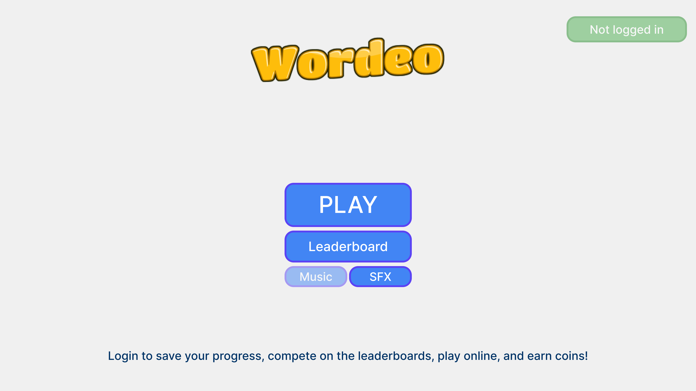
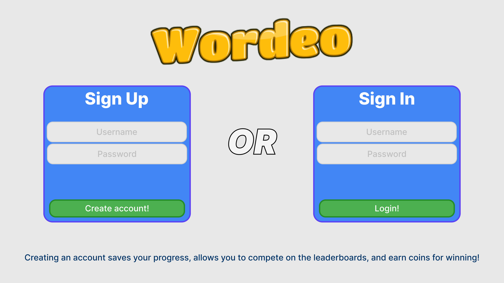
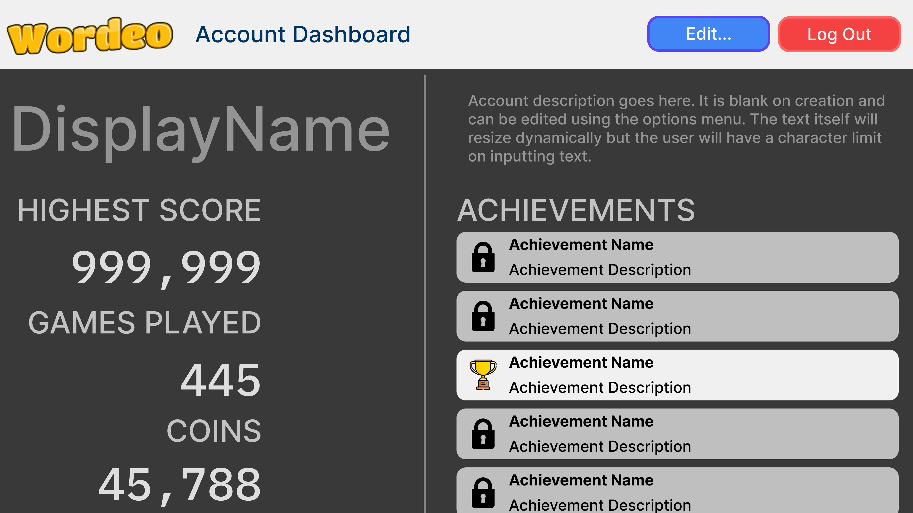
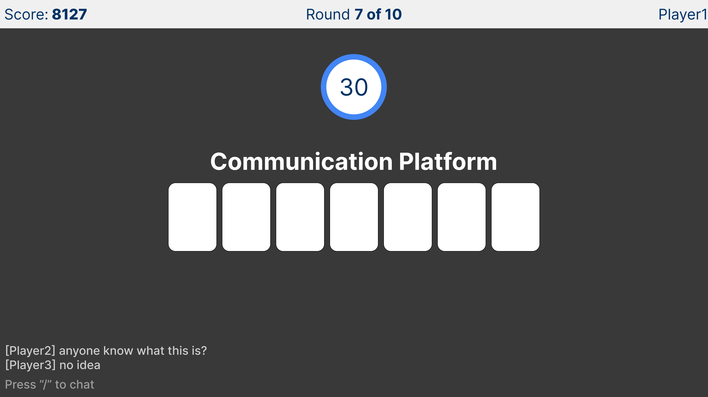
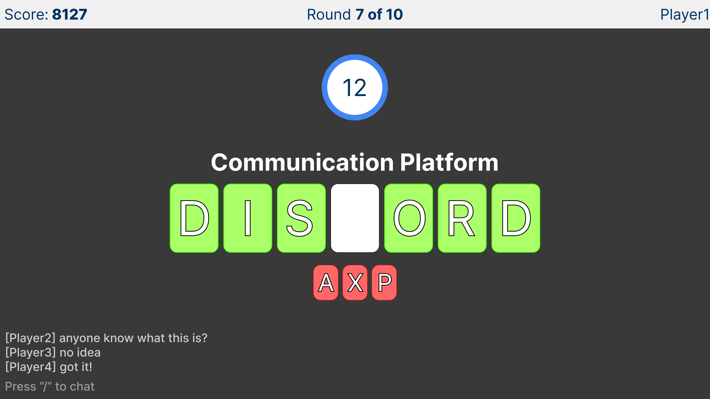
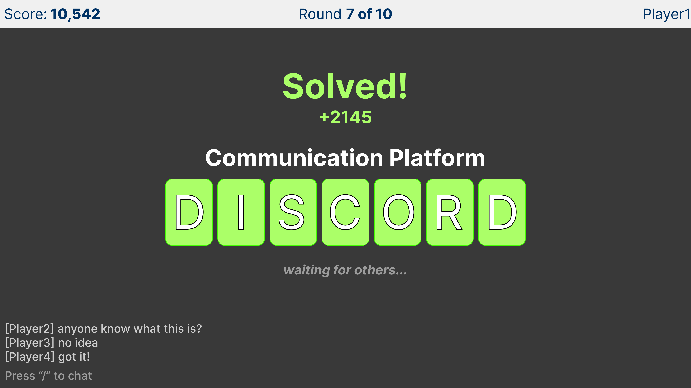
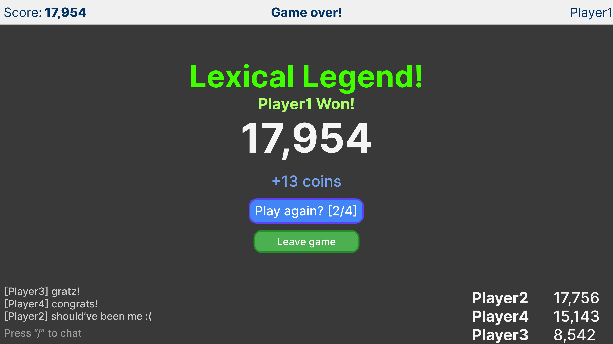

 Design 

We decided for the following on the design of Wordeo.

[`⬅️ Go Back`](../../README.md)

### Table of Contents 
- [Navigation](#navigation)
    - [Home Page](#home-page)
    - [Login Page](#login-page-⬆️)
    - [Account Management](#account-management-⬆️)
- [Gameplay Loop](#gameplay-loop)
    1. [Clue Shown](#1-clue-shown-⬆️)
    2. [Letters being typed](#2-letters-being-typed-⬆️)
    3. [Puzzle Solved](#3-puzzle-solved-⬆️)
    4. [Winning Game](#4-winning-game-⬆️)

# Navigation
## Home Page 

> **PLAY** allows the user to pick between solo play, and multiplayer.
>
> **Not logged in** lets user [login](#login-page-⬆️), or if logged in will allow user to [manage account](#account-management-⬆️), view achievements, statistics, and coins earned during gameplay.
>
> **Leaderboard** lets user view leaderboard of high scorers between solo play and multiplayer.
>
> **Music** and **SFX** toggles the music and sound effects in game.

## Login Page [⬆️](#table-of-contents)

> **Sign Up** and **Sign In** panes allow the user to create an account.
>
> [**Go back**](#home-page) to the home page by clicking the Wordeo logo.

## Account Management [⬆️](#table-of-contents)

> **Edit...** allows the user to edit their display name, their account description, and the option to log out would be replaced by a delete account option with a confirmation box.
>
> **HIGHEST SCORE** shows the user's highest ever score across all gamemodes and games played.
>
> **GAMES PLAYED** shows the user's amount of times they have completed a game.
>
> **COINS** shows the user's current balance for coins.
>
> **ACHIEVEMENTS** shows the user's achievements both in a locked state and unlocked state.
>
> **Log Out** button will provide the user with the option to log out, with a confirmation box.

# Gameplay Loop
## 1. Clue Shown [⬆️](#table-of-contents)

> Clue is shown to user, keyboard input enabled. Chat option is available now by entering `/`.
## 2. Letters being typed [⬆️](#table-of-contents)

> Correct letters will be revealed in the puzzle as green, while wrong letters will be revealed will be revealed as red, and deducting score from the user.
## 3. Puzzle Solved [⬆️](#table-of-contents)

> Puzzle is solved, all letters are revealed.
>
>
> **Solo play**: next round starts after a second or two delay.
>
> **Multiplayer**: next round starts when all users are done or when time is up.
## 4. Winning Game [⬆️](#table-of-contents)

> User winning the game will see a winning screen, with total score, scores of other players, and coins earned. Options given are to play again with the same players, or exit the game.